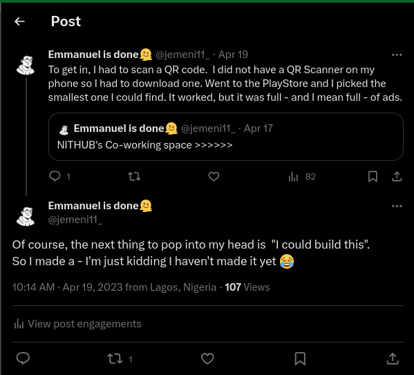

## Introduction

SnapQR is a QR code scanner and generator app for mobile devices. It is built with React Native and Expo.

## Why did I build this?

This [tweet](https://x.com/jemeni11_/status/1648616017982005248?s=20).

This project has a hashtag: [#Jemeni11madeSnapQR](https://twitter.com/hashtag/Jemeni11madeSnapQR?src=hashtag_click)

## Planned Features

- [ ] Scan QR codes
- [ ] Generate QR codes
- [ ] Save QR codes
- [ ] Share QR codes
- [ ] Scan history
- [ ] Scan statistics
- [ ] Scan security
- [ ] Cloud Backup

## ~~Built~~ Building with

This list is subject to change as the project progresses.

- [React v18.2](https://react.dev/)
- [React Native v0.72](https://reactnative.dev/)
- [Expo SDK v49](https://expo.dev)
- [Typescript v5.1](https://www.typescriptlang.org/)
- [React Native Safe Area Context v4.5](https://github.com/th3rdwave/react-native-safe-area-context#readme)
- [Expo Fonts v11.4](https://docs.expo.dev/versions/latest/sdk/font/)
- [Expo Google Fonts v0.2](https://docs.expo.dev/guides/using-custom-fonts/#using-a-google-font) ([Inter](https://fonts.google.com/specimen/Inter))
- [Expo Clipboard v4.1](https://docs.expo.dev/versions/latest/sdk/clipboard/)
- [Expo Splash Screen v0.18](https://docs.expo.dev/versions/latest/sdk/splash-screen/)
- [React Native Theme Switch Animation](https://github.com/WadhahEssam/react-native-theme-switch-animation)
- [React Native QRCode Styled](https://github.com/tokkozhin/react-native-qrcode-styled)
- [Expo Router](https://docs.expo.dev/router/installation/)

## Wait a minute, who are you?

Hello there! I'm Emmanuel Jemeni, and while I primarily work as a Frontend Developer, Mobile App Development interests me.
You can find me on various platforms:

- [LinkedIn](https://www.linkedin.com/in/emmanuel-jemeni)
- [GitHub](https://github.com/Jemeni11)
- [Twitter/X](https://twitter.com/Jemeni11_)
